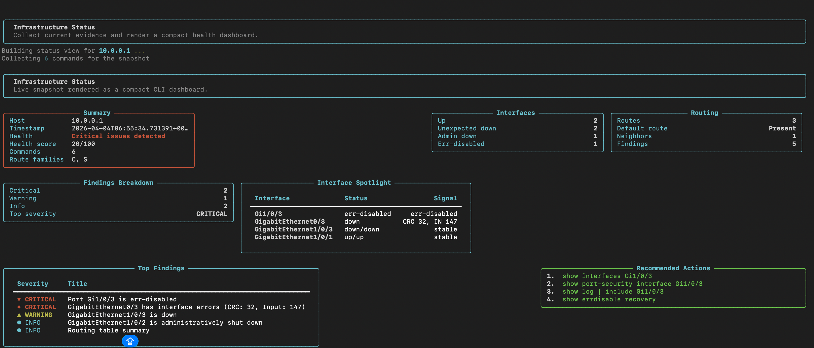

# MindNet

[](https://github.com/x2vmbwtsjf-afk/mindnet/actions/workflows/ci.yml)
[](https://www.python.org/)
[](LICENSE)

**A local-first infrastructure intelligence layer for AI-assisted operations.**

MindNet is a serious infrastructure software project aimed at helping engineers
understand, model, reason about, and operate infrastructure environments with
better context and safer decision-making.

Today, MindNet provides a local CLI, deterministic parsers, snapshot modeling,
connector abstractions, offline analysis, and a rule-based findings pipeline.
Longer term, it is intended to evolve into an infrastructure reasoning engine
that can ingest state, interpret intent, plan actions, and hand execution off
to purpose-built tools.

## Overview

MindNet is not positioned as "just another network CLI helper".

It is the beginning of an infrastructure intelligence layer:
- local-first by default
- deterministic before generative
- reasoning-oriented rather than execution-oriented
- designed to model infrastructure state, not just print command output

MindNet currently focuses on:
- collecting infrastructure context through CLI-oriented workflows
- normalizing outputs into structured models
- generating deterministic findings and explanations
- supporting offline analysis for saved or pasted outputs

## Why MindNet exists

Most infrastructure tooling falls into one of two categories:
- execution tools that run commands, apply configuration, or orchestrate tasks
- dashboards that display state but do not reason well about what it means

MindNet exists to fill the gap between those layers.

The project is intended to become a system that can:
- understand infrastructure context
- reason about relationships between devices, services, and topology
- interpret operator intent
- plan safe next steps
- hand off execution to a more appropriate tool when action is required

That distinction matters because useful AI in infrastructure is not only about
generating commands. It is about understanding context before execution.

## Core concepts

MindNet is built around a few core ideas:

- `Context ingestion`: collect raw operational data from commands, files, and future connectors.
- `Infrastructure modeling`: turn raw outputs into typed structures such as interfaces, routes, neighbors, and snapshots.
- `Deterministic reasoning`: derive findings from rules before layering on optional AI explanations.
- `Intent-aware evolution`: prepare the system to understand what an engineer wants, not only what a device returns.
- `Execution handoff`: keep reasoning and execution separate so actions can later be delegated safely.
- `Local-first operation`: keep analysis, state, and credentials local unless explicitly integrated elsewhere.

## Key capabilities

Current capabilities:
- SSH-based device connectivity checks
- single-command execution
- predefined audit bundle
- structured device snapshots
- deterministic rule evaluation
- plain-language command explanation
- offline analysis for pasted or saved CLI output
- connector abstraction for future API-backed collection
- secure local credential storage via OS keyring

Near-term capabilities implied by the current architecture:
- broader infrastructure context ingestion
- topology-aware correlation
- session and state continuity
- intent parsing and planning
- integration with execution-oriented systems

## How it differs from MidMan

MindNet and MidMan should not collapse into the same identity.

| Area | MindNet | MidMan |
|---|---|---|
| Primary role | reasoning and infrastructure intelligence | safe execution and diagnostics |
| Focus | understanding context and planning | interacting with targets directly |
| Main output | models, findings, explanations, plans | command execution, operational workflows |
| Scope | infra understanding across devices/services/topology | direct CLI-first operations |
| Future direction | reasoning engine, orchestration layer, context graph | operator-facing execution assistant |

Short version:
- **MidMan** should be the thing that executes safely.
- **MindNet** should be the thing that understands what should happen before execution.

## Architecture overview

MindNet currently has a practical MVP architecture:
- CLI entrypoint in `src/netmind/cli.py`
- connector abstraction in `src/netmind/connectors/`
- security/config storage in `src/netmind/security/`
- snapshot-oriented modeling in `src/netmind/models.py`
- deterministic rules in `src/netmind/rules.py`
- parsing and explanation in `src/netmind/explain.py`

This is enough to support a credible next step toward infrastructure reasoning.

High-level flow:
1. collect context from a device, file, or stdin
2. normalize it into typed structures
3. evaluate deterministic rules
4. explain findings in operator-friendly language
5. preserve the option for later planning and execution handoff

See [docs/ARCHITECTURE.md](docs/ARCHITECTURE.md) for the longer architecture view.

## Project status

MindNet is in an **early local-first MVP** stage.

What exists now:
- installable CLI entrypoint: `mindnet`
- mock mode for offline development
- SSH connector path
- snapshot model and deterministic rule engine
- offline CLI analysis commands
- basic CI

What does **not** exist yet:
- service or topology graph
- intent parser
- planning engine
- persistent operational memory
- multi-agent orchestration
- web UI or hosted control plane

This repository should therefore be read as:
- technically real
- strategically opinionated
- intentionally early

## Getting started

Requirements:
- Python 3.11+
- local development environment
- optional OS keyring support for stored credentials

### Local development install

```bash
git clone https://github.com/x2vmbwtsjf-afk/mindnet.git
cd mindnet

python -m venv .venv
source .venv/bin/activate

pip install -r requirements.txt
pip install -e .
```

### Product-style install with `pipx`

```bash
pipx install .
```

Install directly from GitHub:

```bash
pipx install git+https://github.com/x2vmbwtsjf-afk/mindnet.git
```

Verify:

```bash
mindnet --help
mindnet version
```

## Usage examples

### Mock mode

```bash
export NETMIND_MOCK=true

mindnet connect 10.0.0.1
mindnet status 10.0.0.1
mindnet run 10.0.0.1 "show version"
mindnet audit 10.0.0.1
```

### Status dashboard

MindNet can render a compact CLI-native dashboard for the current infrastructure
snapshot, including health score, connected devices, observed platforms,
snapshot age, routing posture, interface hotspots, and recommended next steps.

```bash
export NETMIND_MOCK=true
mindnet status 10.0.0.1
```



### Offline analysis from a file

```bash
mindnet analyze-file mock_data/show__ip__route.txt
mindnet analyze-file --type interfaces-status mock_data/show__interfaces__status.txt
```

### Offline analysis from stdin

```bash
cat mock_data/show__cdp__neighbors.txt | mindnet explain-output
cat mock_data/show__interfaces__status.txt | mindnet explain-output --type interfaces-status
```

### Snapshot workflow

```bash
export NETMIND_MOCK=true
mindnet snapshot export 10.0.0.1 /tmp/mindnet-snapshot.json
mindnet snapshot show /tmp/mindnet-snapshot.json
mindnet snapshot analyze /tmp/mindnet-snapshot.json
```

## Roadmap

MindNet should evolve in stages, not by overpromising.

Current roadmap direction:
1. local-first MVP and reliable modeling
2. infrastructure context and topology awareness
3. intent understanding and action planning
4. execution handoff into tools such as MidMan
5. session memory and operational context
6. multi-node and multi-environment orchestration
7. ecosystem integrations and broader interfaces

See [ROADMAP.md](ROADMAP.md) for the detailed phased plan.

## Contributing

MindNet is still defining its long-term architecture, which makes good
contributions especially valuable.

Good contribution areas:
- parser quality
- context modeling
- connector abstractions
- reasoning modules
- documentation and architecture clarification
- safety and security hardening

See [CONTRIBUTING.md](CONTRIBUTING.md) for setup and contribution guidance.

## License

MIT
